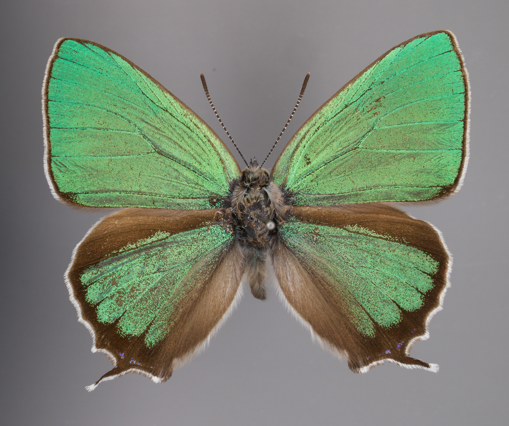

# ゼフィルス

## 設計のポイント
- 全体が「頭部・胸部・腹部」の3つに分かれ、胸部から4枚の翅と6本の脚が生える構造になっており、工作を通して昆虫の体の仕組みを学ぶことができます。
- 翅は開閉させることが可能です。

## 展開図
[展開図(PDF)](templates/zephyrus-template.pdf)

- 5mm厚のスチレンボードを想定して設計しています。異なる厚みのボードを使用する場合は、スリット（溝）の幅を調整してください。
- 溝の幅をやや細めにカットすると、接着剤なしでもパーツ同士がカチッとはまります。

ゼフィルスの型紙

## 完成図

ゼフィルスの完成図1

      

ゼフィルスの完成図2

## モデル

モデルとなったジョウザンミドリシジミ♂の標本

---
- Published: 2026-06-10
- Author: [itots](https://github.com/itots)
