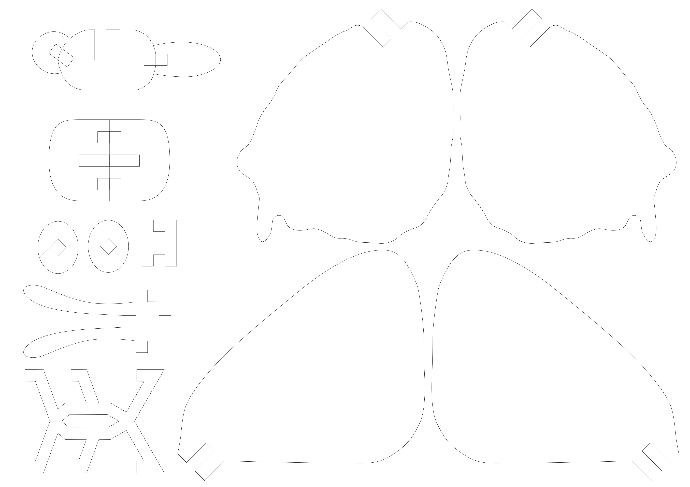
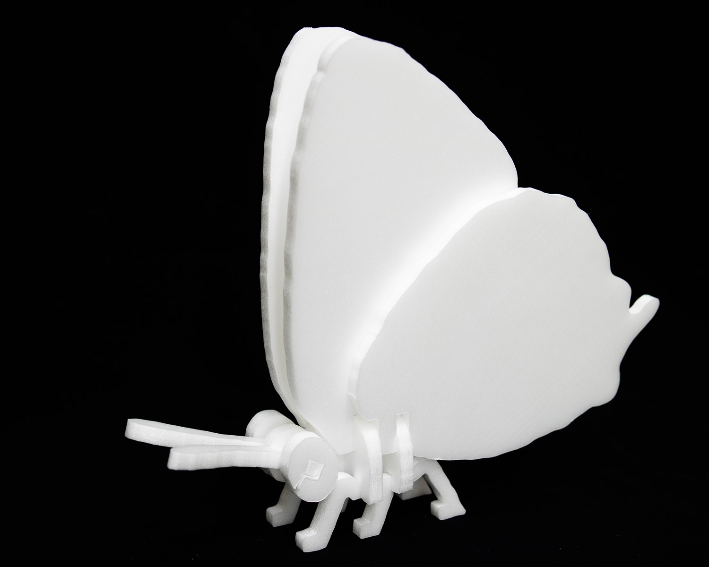
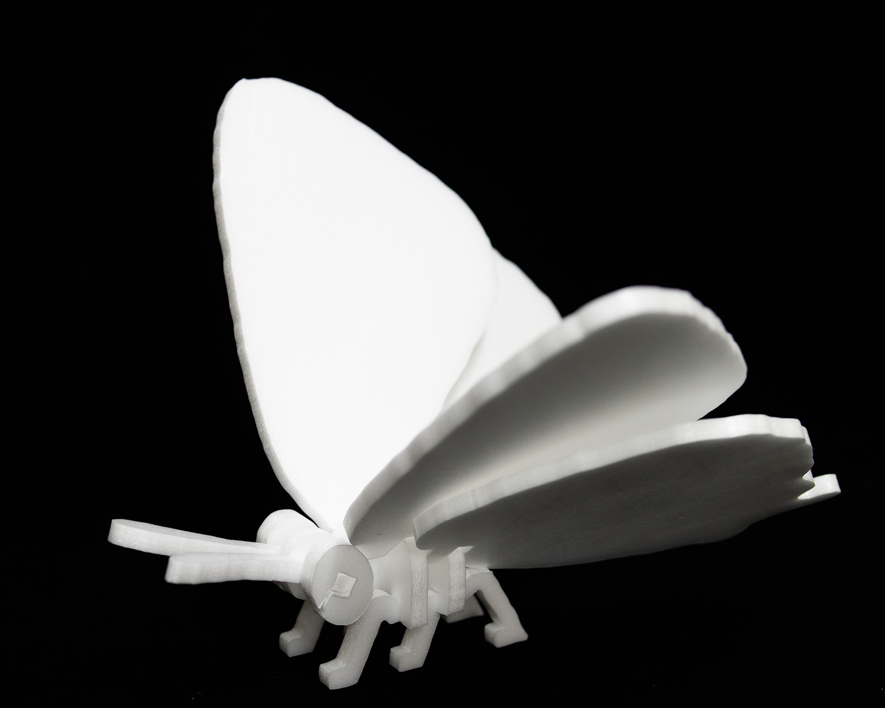

# Zephyrus

## 型紙
[型紙(PDF)](templates/zephyrus-template.pdf)

- 5mm厚のスチレンボードを想定しています。厚みが異なる場合は調整してください。
- 溝はやや細めに切り取るとカチッとハマります。

ゼフィルスの型紙

## 完成図

ゼフィルスの完成図1

      

ゼフィルスの完成図2

## モデル

モデルとなったジョウザンミドリシジミ♂の標本

